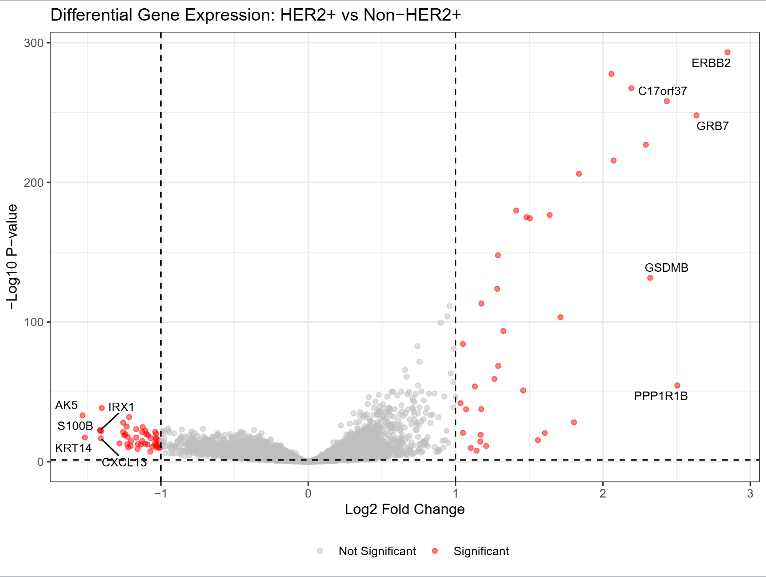
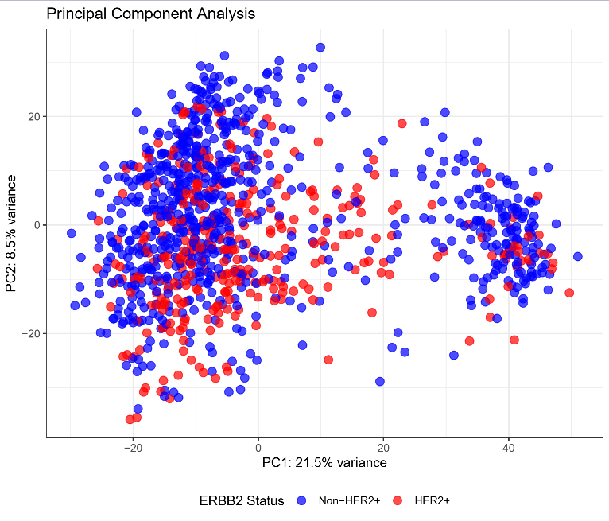
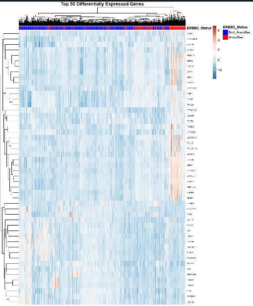

# HER2+ Breast Cancer Gene Expression Analysis

Differential gene expression analysis of HER2-amplified vs non-amplified breast cancer tumours using TCGA RNA-seq data.

## Overview

This project analyzes RNA-seq data from The Cancer Genome Atlas (TCGA) breast cancer cohort to identify differentially expressed genes between HER2-amplified (ERBB2+) and non-amplified tumours. The analysis includes differential expression testing, pathway enrichment analysis, and visualization of gene expression patterns.

### Clinical Context

HER2+ breast cancer represents ~15-20% of cases and is associated with aggressive disease. Understanding the molecular landscape may reveal novel therapeutic targets and biomarkers for treatment response.

## Project Structure

```
├── scripts/                    # Analysis scripts
│   ├── 01_data_preprocessing.R
│   ├── 02_differential_expression.R
│   ├── 03_pathway_enrichment.R
│   ├── 04_visualization.R
│   └── 05_survival_analysis.R
├── data/                      # Raw data directory
├── figures/                   # Generated plots
└── results/                   # Analysis outputs
```

## Key Results

### Differential Expression

The analysis identified significantly differentially expressed genes between HER2+ and non-HER2+ tumours using DESeq2 (padj < 0.05, |log2FC| > 1).


*Volcano plot showing differentially expressed genes. Red points indicate significant genes (adjusted p-value < 0.05 and |log2FC| > 1).*

### Expression Patterns

Principal component analysis reveals distinct clustering of HER2+ and non-HER2+ samples based on gene expression profiles.


*PCA plot showing separation between HER2+ and non-HER2+ samples along principal components.*

### Top Differentially Expressed Genes

Hierarchical clustering of the top 50 differentially expressed genes shows distinct expression patterns between the two groups.


*Heatmap of the top 50 differentially expressed genes, with samples grouped by HER2 status.*

## Methods

- **Differential Expression**: DESeq2 with Wald test
- **Significance Threshold**: padj < 0.05, |log2FC| > 1
- **Pathway Enrichment**: clusterProfiler (GO and KEGG)
- **Dimensionality Reduction**: PCA on variance-stabilized transformed data
- **Survival Analysis**: Lasso Cox proportional hazards regression

## Installation

### Prerequisites

- R ≥ 4.3.0
- Required R packages (Bioconductor and CRAN)

### Install Dependencies

```r
# Install BiocManager
if (!require("BiocManager", quietly = TRUE))
    install.packages("BiocManager")

# Install required packages
BiocManager::install(c(
  "DESeq2", "clusterProfiler", "org.Hs.eg.db",
  "EnhancedVolcano", "ComplexHeatmap"
))

install.packages(c(
  "tidyverse", "pheatmap", "glmnet",
  "survival", "survminer", "ggrepel", "RColorBrewer"
))
```

## Usage

### Run Complete Analysis

```r
# Set working directory
setwd("path/to/Gene-Expression-Analysis-and-Interpretation")

# Run complete pipeline
source("scripts/main_analysis.R")
```

### Run Individual Steps

```r
source("scripts/01_data_preprocessing.R")
source("scripts/02_differential_expression.R")
source("scripts/03_pathway_enrichment.R")
source("scripts/04_visualization.R")
source("scripts/05_survival_analysis.R")
```

## Data Source

Data obtained from [TCGA Breast Cancer Study](https://www.cbioportal.org/study/summary?id=brca_tcga_pan_can_atlas_2018) via cBioPortal.

Required files:
- `data_mrna_seq_v2_rsem.txt` (RNA-seq data)
- `data_clinical_patient.txt` (Clinical annotations)
- `data_cna.txt` (Copy number alterations)

Place downloaded files in the `data/` directory.

## Outputs

The analysis generates:

**Figures** (`figures/` directory):
- Volcano plot of differential expression
- PCA plot showing sample clustering
- Heatmap of top differentially expressed genes
- Pathway enrichment visualizations
- Kaplan-Meier survival curves

**Results** (`results/` directory):
- Differential expression results (all genes and significant genes only)
- Pathway enrichment results (GO and KEGG)
- Prognostic gene signatures from survival analysis

## License

MIT License

## Acknowledgments

- **Data Source**: The Cancer Genome Atlas (TCGA)
- **Tools**: DESeq2, clusterProfiler, glmnet
- **Course**: ANAT40040 - Bio Principles & Cellular Org, University College Dublin

## Contact

**Caolán Maguire**  
Caolan.Maguire@ucdconnect.ie
University College Dublin

---

*Last Updated: December 2025*
